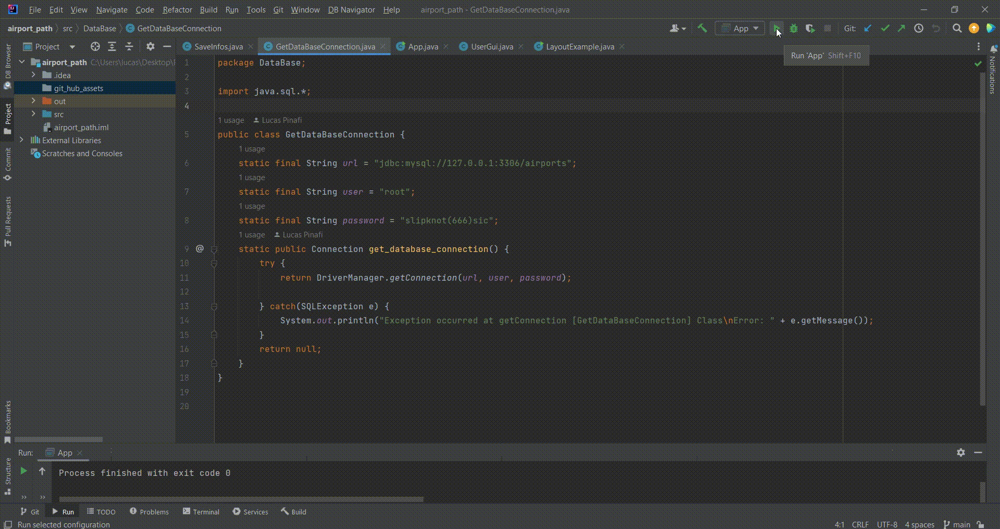
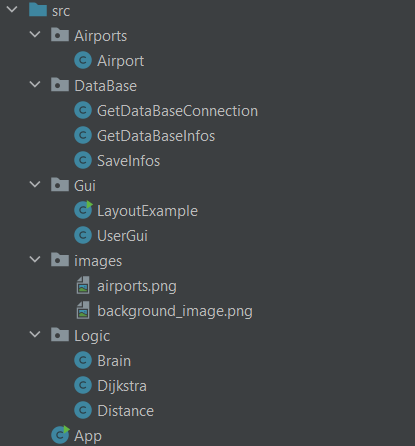

### Trabalho COMPUTAÇÃO - IME 2022 - Al PINAFI 20044 
# Tabela de conteúdos
<!--ts-->
   * [Sobre](#Sobre)
   * [Funcionamento](#Funcionamento)
   * [Organização](#Organização)
      *    [AppClass](###App)
<!--te-->

# Sobre 
Esse trabalho utiliza o algoritmo de dijkstra para calcular a menor rota entre dois aeroportos. Aqui, optei por criar um banco de dados que oferece os caminhos reais que cada aeroporto pode oferecer. Dessa forma, poderemos ter um número variável (e inclusive não ter escala alguma) entre dois aeroportos.

# Funcionamento
GIF monstrando o programa em funcionamento. Para facilitar o acesso, criei uma GUI onde o usuário pode escolher o estado de origem e o estado final. A partir desses inputs, o programa é capaz de decidir quais aeroportos estarão disponíveis para o usuário. Note que, quando a origem e o destino são identicos (isso é, mesmos estados e mesmos aeroportos) o botão de calcular rota é desabilitado. 

<h1 align="center">
  
</h1>

# Organização
A lógica do projeto foi organizada com a seguinte formatação. 
<h1 align="center">
  
</h1>

### App
